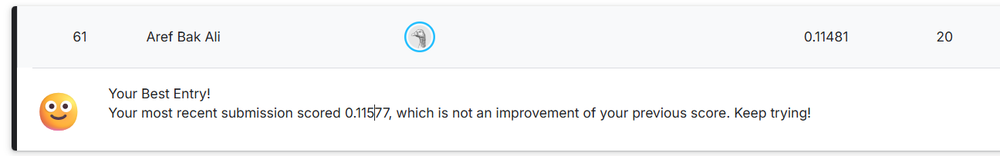
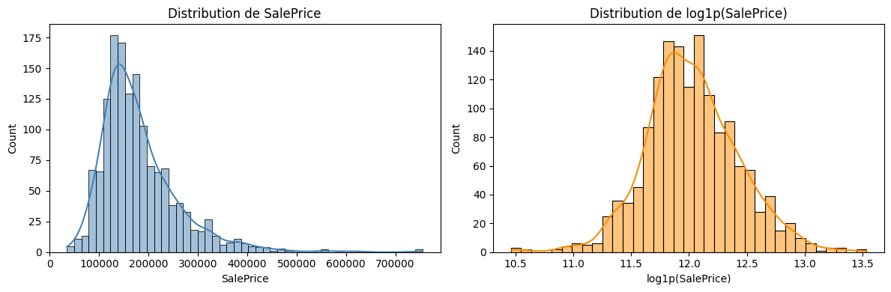
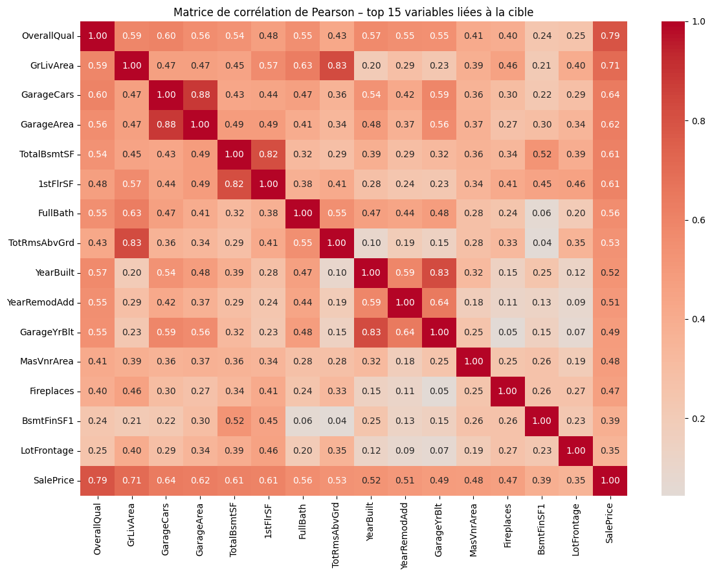
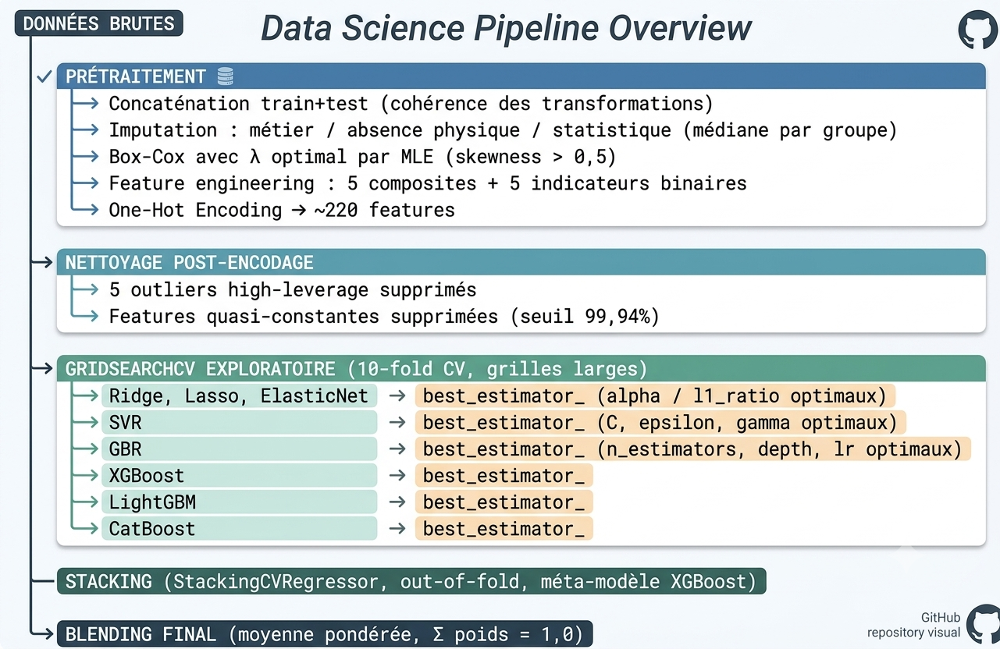

# Kaggle House Prices Prediction

## Project Date

**May 2026**

## Overview

This project presents an advanced regression pipeline for the Kaggle competition **House Prices - Advanced Regression Techniques**. The objective is to predict residential house sale prices using structured data from the Ames Housing dataset.

The project covers the full Machine Learning workflow: exploratory data analysis, missing value treatment, feature engineering, skewness correction, model optimization, stacking, blending and Kaggle submission generation.

## Kaggle Result

This solution achieved a Kaggle score of **0.11481**, ranking **61st out of 5,235 teams**.



## Project Context

House price prediction is a classic regression problem where the goal is to estimate the final sale price of a property based on multiple numerical and categorical features such as location, living area, overall quality, garage size, basement information and construction year.

This project investigates the following question:

> How can advanced feature engineering and ensemble learning improve house price prediction performance on structured tabular data?

## Dataset

The project uses the dataset from the Kaggle competition **House Prices - Advanced Regression Techniques**.

The data includes:

* Training data with house features and sale prices
* Test data without the target variable
* A sample submission file
* A detailed data description file

Main feature groups include:

* Property characteristics
* Neighborhood and zoning
* Building quality and condition
* Basement and garage features
* Living area and room information
* Year of construction and remodeling
* Sale type and sale condition

The dataset is stored in the `data/` folder:

```text
data/
├── train.csv
├── test.csv
├── sample_submission.csv
└── data_description.txt
```

## Methodology

The project is divided into two main notebooks:

### 1. Exploratory Data Analysis

The EDA notebook focuses on understanding the dataset and preparing modeling decisions.

Main steps:

* Initial data inspection
* Numerical and categorical analysis
* Missing value analysis
* Outlier detection
* SalePrice distribution analysis
* Correlation analysis
* Statistical tests
* Feature interpretation before modeling

### 2. Modeling Pipeline

The modeling notebook builds an advanced regression workflow.

Main steps:

1. Log transformation of the target variable
2. Train/test concatenation for consistent preprocessing
3. Conversion of numerical categorical variables
4. Missing value imputation
5. Skewness correction using Box-Cox transformation
6. Feature engineering
7. One-hot encoding
8. Outlier removal
9. Quasi-constant feature removal
10. Hyperparameter tuning with GridSearchCV
11. Stacking using StackingCVRegressor
12. Final weighted blending
13. Submission file generation

## Feature Engineering

Several engineered features were created to improve predictive performance:

* `TotalSF`
* `Total_sqr_footage`
* `Total_Bathrooms`
* `YrBltAndRemod`
* `Total_porch_sf`
* `haspool`
* `has2ndfloor`
* `hasgarage`
* `hasbsmt`
* `hasfireplace`

Skewed numerical variables were transformed using Box-Cox to reduce the impact of extreme values and improve model stability.

## Models Used

The project compares and combines multiple regression models:

| Model                       | Role                                    |
| --------------------------- | --------------------------------------- |
| Ridge                       | Regularized linear regression           |
| Lasso                       | Feature selection and regularization    |
| ElasticNet                  | Combination of L1 and L2 regularization |
| SVR                         | Non-linear regression                   |
| Gradient Boosting Regressor | Tree-based boosting                     |
| XGBoost                     | Gradient boosting model                 |
| LightGBM                    | Efficient gradient boosting             |
| CatBoost                    | Categorical boosting model              |
| StackingCVRegressor         | Ensemble stacking                       |
| Weighted Blending           | Final prediction aggregation            |

## Final Ensemble Strategy

The final prediction is based on a weighted blend of several trained models:

* ElasticNet
* Lasso
* Ridge
* SVR
* Gradient Boosting
* XGBoost
* LightGBM
* CatBoost
* StackingCVRegressor

This blending strategy helps reduce individual model bias and improves generalization on the Kaggle test set.

## Results

| Metric       |            Value |
| ------------ | ---------------: |
| Kaggle Score |          0.11481 |
| Kaggle Rank  | 61 / 5,235 teams |

The final submission file is available in:

```text
outputs/submission.csv
```

## Visual Results

### SalePrice Distribution



### Correlation Heatmap



### Model Architecture



## Project Structure

```text
kaggle-house-prices-prediction/
│
├── README.md
├── requirements.txt
├── .gitignore
│
├── data/
│   ├── train.csv
│   ├── test.csv
│   ├── sample_submission.csv
│   └── data_description.txt
│
├── notebooks/
│   ├── house_prices_eda.ipynb
│   └── house_prices_modeling.ipynb
│
├── outputs/
│   └── submission.csv
│
└── images/
    ├── kaggle_score.png
    ├── saleprice_distribution.png
    ├── correlation_heatmap.png
    └── model_architecture.png
```

## How to Run

### 1. Clone the repository

```bash
git clone https://github.com/arefbakali/kaggle-house-prices-prediction.git
cd kaggle-house-prices-prediction
```

### 2. Create a virtual environment

```bash
python -m venv .venv
```

### 3. Activate the environment

On Windows:

```bash
.venv\Scripts\activate
```

On macOS/Linux:

```bash
source .venv/bin/activate
```

### 4. Install dependencies

```bash
pip install -r requirements.txt
```

### 5. Open the notebooks

```bash
jupyter notebook notebooks/house_prices_eda.ipynb
```

```bash
jupyter notebook notebooks/house_prices_modeling.ipynb
```

## Requirements

Main libraries used:

* Python
* Pandas
* NumPy
* Scikit-learn
* SciPy
* Matplotlib
* Seaborn
* XGBoost
* LightGBM
* CatBoost
* MLxtend
* Jupyter Notebook

## Key Takeaways

* Strong preprocessing and feature engineering are critical for tabular regression problems.
* Log transformation of the target variable improves stability for house price prediction.
* Box-Cox transformation helps reduce skewness in numerical features.
* Regularized linear models remain competitive when combined with robust preprocessing.
* Stacking and blending improve final generalization on the Kaggle leaderboard.
* The final model achieved a strong public Kaggle score of **0.11481**.

## Limitations

* The leaderboard score is based on Kaggle’s hidden test set.
* Some features require domain-specific interpretation.
* The pipeline is optimized for this competition dataset and may require adaptation for real-world deployment.
* The final blend is manually weighted and could be further optimized.

## Future Improvements

* Automate blending weight optimization
* Add SHAP-based model explainability
* Build a Streamlit demo for predicting house prices
* Test additional feature selection strategies
* Add experiment tracking with MLflow or Weights & Biases

## Contact

- **GitHub:** https://github.com/arefbakali
- **LinkedIn:** https://www.linkedin.com/in/aref-bak-ali/
- **Email:** aref.bak-ali@dauphine.eu
- **Portfolio:** https://portfolio-aref.vercel.app/

## Author

**Aref Bak Ali**  
AI, Data Science & Agentic AI Student  
Université Paris Dauphine-PSL
